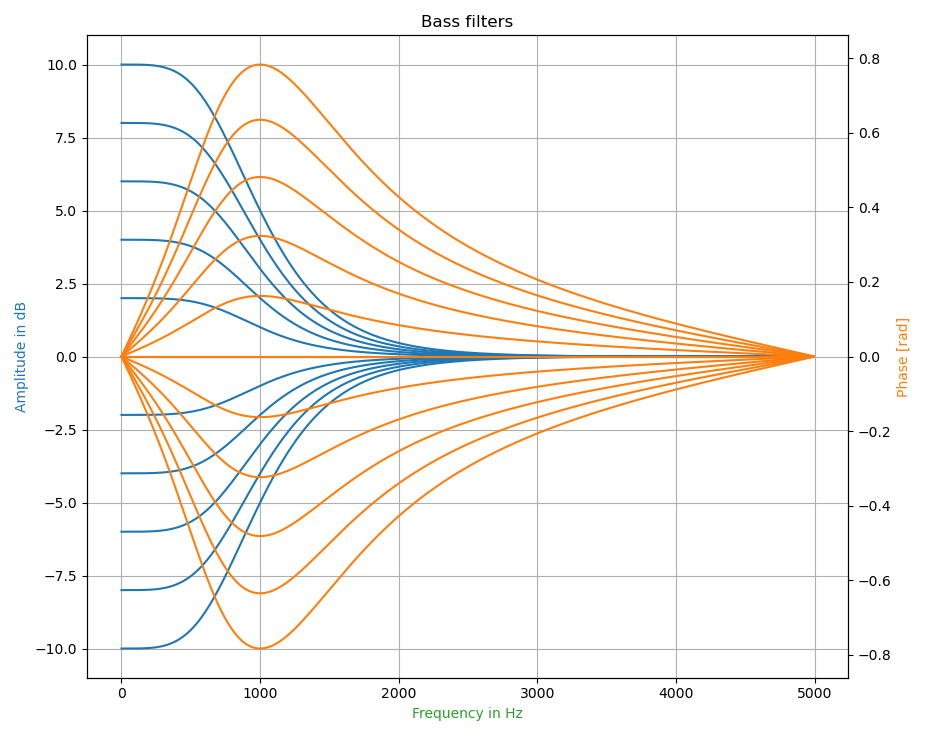
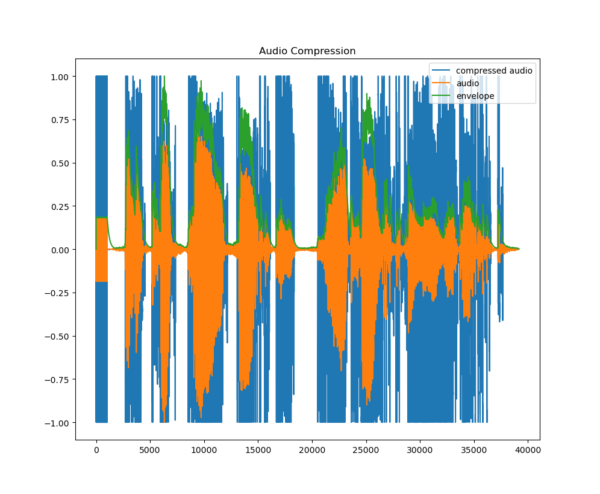
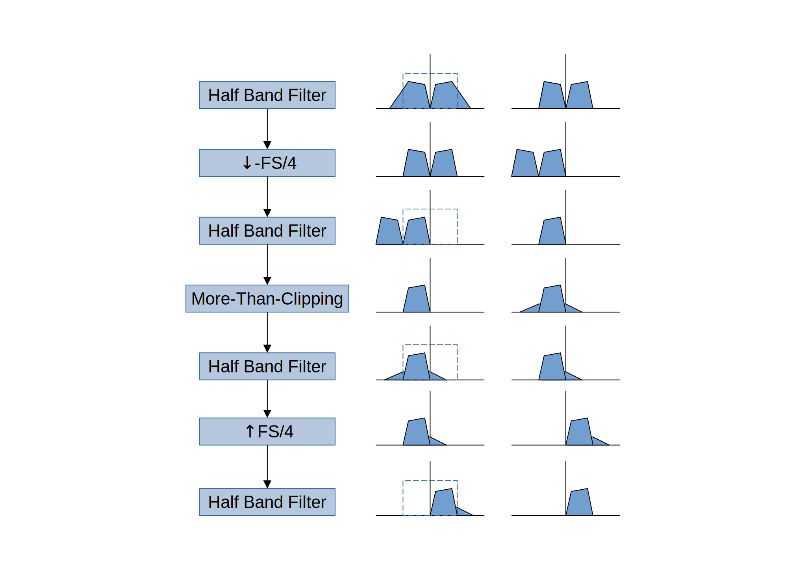
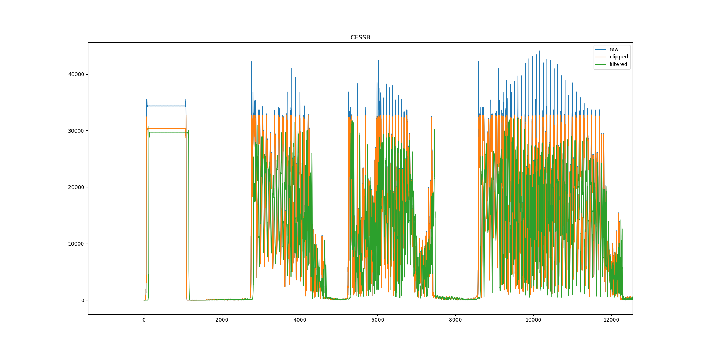
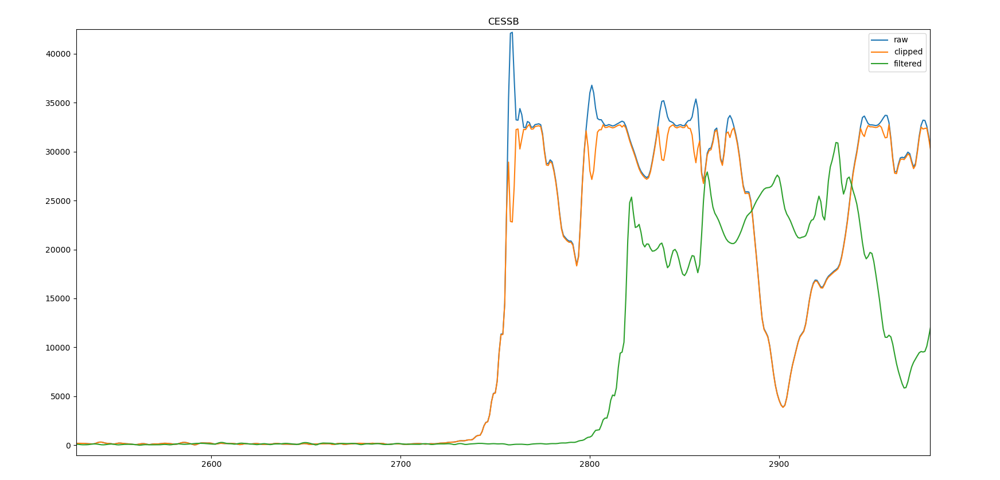
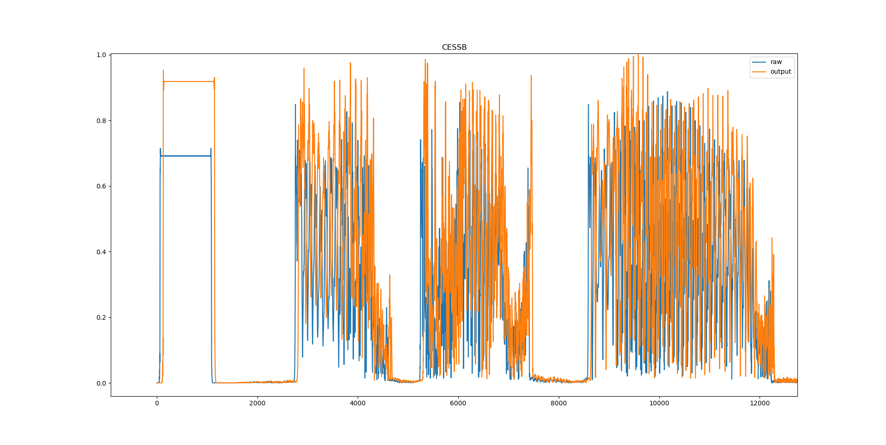

Pi Pico Rx Transceiver Experiments
----------------------------------

This page documents a series of experiments investigating the addition of transmit capability to the Pi Pico RX receiver platform.

Some time ago I developed a standalone transmitter based on similar techniques and hardware. While it appeared feasible to combine this transmitter with the Pi Pico RX to create a simple transceiver, the resulting spurious performance was not satisfactory. Although the concept worked, unwanted emissions and spectral purity became significant concerns that needed to be addressed before the approach could be considered practical.

The primary goal of these experiments is therefore to investigate methods of improving spurious performance and to assess the overall viability of building a simple, low-cost transceiver around the Pi Pico RX architecture.

A number of different approaches have been explored. Some experiments focus on incremental improvements to the original design, while others revisit the problem from first principles and investigate entirely different transmitter architectures. Along the way I have also examined a range of more advanced transmit features, including speech processing and Controlled Envelope Single Sideband (CESSB), to better understand what level of performance can realistically be achieved using the RP2040/RP2350 platform.

The results presented here are not intended as a finished design. Rather, they document an ongoing engineering investigation into the capabilities and limitations of software-defined transmit techniques on the Raspberry Pi Pico, highlighting both successful approaches and ideas that proved less effective than expected.

Caution
=======

This project is an experimental research effort and should be viewed in the spirit of scientific exploration rather than as a finished design.

The material presented here documents investigations, prototypes, measurements, successes, and failures as I explore the possibility of adding transmit capability to the Pi Pico RX platform. Many of the techniques and circuits described are works in progress and may change substantially as the project evolves.

No guarantees are made regarding performance, spectral purity, regulatory compliance, or suitability for on-air operation. In particular, some experimental transmitter configurations may produce unacceptable levels of spurious emissions or other unwanted signals. Anyone wishing to reproduce these experiments is responsible for verifying the performance of their own equipment and ensuring compliance with applicable regulations before transmitting.

This project should not be considered a construction guide, product, or recommendation for practical use. Designs, software, hardware configurations, and conclusions may change significantly as new ideas are tested and better approaches are discovered.

Finally, while I am happy to share my findings, I am unable to provide ongoing support for individual builds, hardware modifications, bug fixes, troubleshooting, or feature requests. The information is published primarily as a record of my own experiments and to encourage further investigation by others with similar interests.

Experimental Code
=================

The code used in the experimental transmitter may be found here: `branch <https://github.com/dawsonjon/PicoRX/tree/xcvr>`_

Polar vs IQ Modulation
======================

Two primary transmit architectures are being explored in these experiments. Both are intended to assess different trade-offs in complexity, spectral performance, and flexibility when implemented on the Pi Pico RX platform.

Polar Modulated Transmitter (Original Approach)
'''''''''''''''''''''''''''''''''''''''''''''''

The first approach builds on a previously developed standalone transmitter design based on polar modulation. In this architecture, RF generation is handled using a PIO-based numerically controlled oscillator (NCO), with phase modulation applied directly in the digital domain. The amplitude component is then applied separately using a PWM-based output stage to modulate the RF envelope.

This separation of phase and amplitude allows for a highly flexible implementation, but also introduces challenges in maintaining spectral purity, particularly with regard to spurious emissions and unwanted mixing products.

For a complete understanding of the technique, refer to the `original design. <https://101-things.readthedocs.io/en/latest/ham_transmitter.html>`_

QSE-Based Modulator (Conventional Approach)
'''''''''''''''''''''''''''''''''''''''''''

In parallel, a more traditional quadrature sampling exciter (QSE) approach is being investigated. This method uses separate I and Q “audio” paths generated via PWM outputs, which are then fed into a QSE stage. The architecture is conceptually similar to the QSE implementation used in the Pi Pico RX receiver.

This approach is more conventional in SDR design and is expected to provide a more predictable and well-understood signal path. While it may be less exotic than the polar modulation method, it offers a useful fallback option if acceptable performance cannot be achieved with the polar architecture.

In addition, a QSE-based transmitter may ultimately be better suited to a more feature-rich or “bells and whistles” transceiver design, where flexibility and extensibility are more important than absolute minimalism.

Internal vs External NCO
========================

For both the polar-modulated transmitter and the QSE-based transmitter, two oscillator implementation options are being explored: an internal numerically controlled oscillator (NCO) implemented on the RP2040/RP2350, and an external oscillator based on an Si5351 clock generator.

This dual approach is intended to provide flexibility in evaluating trade-offs between integration, phase control, spectral performance, and system complexity.

Across these two modulation architectures and two oscillator options, there are therefore four distinct experimental configurations in total:

+ Polar modulation with internal NCO
+ Polar modulation with external Si5351
+ QSE-based modulation with internal LO
+ QSE-based modulation with external Si5351

These four variants form the core design space being explored in this project.

Polar Modulated Transmitter
'''''''''''''''''''''''''''

In the polar architecture, the internal NCO approach closely follows the original transmitter concept. The RF carrier is generated directly on-chip using a PIO-based oscillator, with phase control applied in software. This allows tight coupling between the modulation process and the carrier generation, enabling fine-grained phase manipulation and rapid updates.

An alternative implementation uses an external Si5351 clock generator. In this configuration, achieving phase modulation requires a different strategy: instead of directly controlling a digital NCO, the system must apply rapid frequency updates to the Si5351 over I2C in order to indirectly modulate phase. This approach is conceptually similar to the technique used in the uSDX transceiver architecture, a novel and disruptive approach where fast frequency stepping is used to approximate continuous phase modulation.

Reference to uSDX-style frequency update approach by Guido (PE1NNZ):
`uSDX <https://github.com/threeme3/usdx>`_

While this method introduces additional more complex hardware and additional constraints compared to an internal NCO, it may offer improved spectral performance.

QSE-Based Transmitter
'''''''''''''''''''''

The QSE-based architecture similarly supports both internal and external local oscillator options. In the Pi Pico RX receiver, a quadrature local oscillator can already be generated internally using PIO-based techniques or provided externally using an Si5351 clock generator.

In this transmitter variant, the same quadrature local oscillator is reused to drive the QSE stage. This reuse of the existing LO infrastructure simplifies the overall system design and maintains consistency with the receiver architecture.

As with the polar implementation, the choice between internal and external oscillator sources represents a key design trade-off between hardware simlicity and spectral purity, and both options are being evaluated as part of the experimental process.

Polar Test Bed
==============

The polar modulation experiments are currently being carried out using a simplified hardware test-bed. The primary focus at this stage is not on producing a complete or transmission-ready system, but rather on characterising the behaviour of the polar modulator itself and comparing its performance against alternative architectures.

As a result, the design intentionally omits elements such as low-pass filtering and RF power amplification. Instead, an analog switch is used as a behavioural stand-in for a polar-modulated RF output stage. This allows the core modulation dynamics and switching behaviour to be evaluated in isolation, without the additional variables introduced by a full RF chain.

A microphone input is provided using one of the spare ADC channels on the Pi Pico, enabling basic audio modulation experiments. In addition, two GPIO pins are used as digital inputs for a simple CW keyer, providing separate dit and dah inputs. These inputs also double as a PTT control mechanism, reducing overall pin count while maintaining functional flexibility.

A single RX/TX control GPIO is used to switch external hardware between receive and transmit modes. This provides a minimal but practical interface for coordinating external RF circuitry during experimentation.

The test-bed is designed to support both internal and external NCO configurations. In addition to the on-chip PIO-based oscillator, provision is included for an external Si5351 module, allowing direct comparison between internally generated RF carriers and externally synthesised clock sources under identical modulation conditions.

The overall hardware configuration is illustrated below:

.. image:: images/transmitter_experiments/polar.svg

This simplified arrangement allows rapid iteration on modulation algorithms and signal generation techniques, while deferring RF chain complexity until the behaviour of the core modulator is better understood.

Polar Concept Internal Oscillator
=================================

A significant portion of the development effort has focused on improving the spectral purity of the internal local oscillator implementation. The original design exhibited clearly visible spurious components. Several architectural and algorithmic changes have been introduced to address these issues.

1. Increasing Phase Update Rate and Interpolation

In the original implementation, the oscillator phase was updated abruptly at the audio sample rate (approximately 10 kHz). This resulted in discrete phase steps applied at regular intervals, which in turn produced strong spurious components spaced at 10 kHz offsets from the carrier. Because these spurs occur very close to the fundamental, they are difficult or impossible to remove using conventional analogue filtering.

The first and most significant improvement was to smooth these transitions by interpolating phase updates in software. Instead of applying a single abrupt phase correction per audio sample, the phase is now slewed gradually over the course of each sample. This effectively increases the internal phase update rate to approximately 500 kHz, allowing the local oscillator phase to evolve smoothly rather than discontinuously. The result is a substantial reduction in close-in spurious energy.

2. Migration from PIO to HSTX Output (Pi Pico 2 / RP2350)

The second major change is the migration from a PIO-based output system to the HSTX peripheral available on the RP2350 (Pi Pico 2). HSTX supports double data rate (DDR) operation, allowing a different value to be output on both the rising and falling edges of the clock. This effectively doubles the usable output rate from approximately 150 MHz to 300 MHz and reduces worst-case timing resolution from ~8 ns to ~4 ns.

Functionally, HSTX can be used in a very similar way to PIO for waveform generation. Precomputed waveform tables are stored in memory and streamed via DMA into the HSTX unit, effectively “playing back” the waveform at the desired carrier frequency. With HSTX, the overall architecture remains largely unchanged compared to the PIO implementation; however, the same waveform generation and DMA scheduling techniques are now applied to the higher-speed output engine.

One important consequence of this change is hardware dependency. Transmit functionality using this approach is only viable on the Pi Pico 2 (RP2350), and the set of usable GPIO pins is constrained to those that support HSTX functionality.

3. Adaptive Clock Frequency Selection

The third improvement leverages an adaptive system clock strategy, already used in the Pi Pico RX design to improve local oscillator frequency resolution. The same concept has been extended to the transmitter.

The key idea is to select the system clock frequency that most closely aligns with an integer multiple of the desired NCO frequency. By doing so, the number of fractional clock corrections required in the waveform generation process is reduced. This minimises the occurrence of “one-clock adjustments” in the output stream, thus reducing the total spurious spectral energy.

.. figure:: images/transmitter_experiments/adaptive_clocks.png

    The figure shows the closest exactly achievable clock for each tuning frequency.

4. Phase Dither to Suppress Periodic Spurs

The fourth improvement introduces phase dithering to break up deterministic error patterns in the NCO update process.

In the original system, small correction steps (“one-clock adjustments”) occur in a repeating pattern. This can be understood intuitively using a calendar analogy: if a small timing error is corrected in a perfectly regular cycle, it behaves like a periodic event—much like a leap year correction that occurs predictably every four years. While the average timing remains correct, the periodic nature of the correction introduces a new spectral component, which appears as discrete spurious tones.

To address this, a controlled amount of random dither is introduced into the phase update process. Instead of following a strictly repeating correction pattern, the timing adjustments are decorrelated and distributed pseudo-randomly over time. This transforms what would otherwise be discrete spectral spurs into broadband noise.

Because this noise is spread across a wide frequency range, its spectral density is significantly lower than the equivalent spur power. Furthermore, a substantial portion of this noise is removed by the transmitter’s output filtering stages, making it far less problematic in practice than deterministic spurious tones.

Overall, the combination of interpolation, higher-speed output hardware, adaptive clock selection, and phase dithering results in a marked improvement in spectral purity compared to the original implementation.

Polar Concept External Oscillator
=================================

An alternative transmitter implementation has been developed using an external Si5351 clock generator. In this configuration, the third output of the Si5351 is dedicated to the transmit signal path, while outputs 1 and 2 remain reserved for the quadrature local oscillator used by the Pi Pico RX receiver. This allows the receiver and transmitter subsystems to coexist while sharing a common frequency reference source.

To support this approach, the existing Si5351 library has been extended with additional functionality to enable rapid, small-step frequency updates. These updates are intended to act as the primary modulation mechanism for transmission.

Modulation Principle
''''''''''''''''''''

Unlike the internal NCO-based approach, which directly manipulates oscillator phase, the Si5351 method operates by dynamically adjusting the output frequency in small increments. These updates are applied continuously at the audio sample rate, effectively encoding the modulation information as short-term frequency deviations.

Because phase is the integral of frequency, this approach implicitly generates the desired phase trajectory over time. However, it is important to note that phase is not directly controlled, and instead emerges from the accumulated effect of frequency changes.

Initial Design Concerns
'''''''''''''''''''''''

Several potential limitations were identified early in the design process:

1. Phase drift and lack of absolute phase control
Since frequency updates are not synchronised to a global phase reference, the absolute phase of the transmitted signal can drift over time. Unlike a true phase accumulator (as used in an NCO), there is no direct mechanism to guarantee phase continuity across updates.

2. I2C bandwidth limitations
The Si5351 is controlled via I2C, which imposes a hard limit on the maximum achievable update rate. This constrains how finely the modulation can be sampled and potentially limits the fidelity of rapid waveform changes.

3. Non-atomic register updates
Frequency configuration in the Si5351 is distributed across multiple registers. These are not updated atomically, meaning that during an update sequence the device may briefly pass through intermediate and potentially incorrect frequency states. These transient states could, in principle, introduce short spurious artefacts.

Implementation Mitigations
''''''''''''''''''''''''''

To address these concerns, several practical optimisations were introduced. The I2C bus was operated at a high speed of 800 kHz, and the modulation sample rate was reduced to approximately 8 kHz to ensure reliable update timing and reduce bus contention.

Initially, results from this configuration were somewhat disappointing, with reduced clarity in the transmitted signal. However, it was found that improving the quality of the audio input path had a significant impact on overall performance. In particular, increasing ADC resolution through oversampling resulted in a much clearer signal.

Results and Conclusion
''''''''''''''''''''''

My initial concerns regarding phase coherence, update latency, and non-atomic register writes proved to be unfounded. The Si5351-based approach ultimately produced surprisingly good results. With appropriate tuning of update rate, I2C speed, and audio signal conditioning, the system was able to generate audio-quality transmissions comparable to the other experimental architectures under consideration.

While the Si5351 method is fundamentally different from the internal NCO approach, it has proven to be a viable alternative for practical experimentation and may offer a useful balance between simplicity, flexibility, and performance in certain configurations.

QSE Test Bed
============

The quadrature sampling exciter (QSE) variant of the transmitter is implemented using a hardware configuration that closely leverages components already present in the Pi Pico RX design. One of the key advantages of this approach is that the existing 74CBLVT3253 analogue multiplexer already includes a spare 4:1 channel, which can be repurposed to implement a QSE stage with minimal additional external hardware.

This allows the QSE transmitter to be integrated into the existing receiver architecture with only modest extensions, making it a particularly attractive “low overhead” experimental path.

I/Q Signal Generation
'''''''''''''''''''''

The in-phase (I) and quadrature (Q) baseband signals are generated using PWM outputs from the Pi Pico. These PWM signals are used as audio-frequency representations of the modulation waveform.

In many conventional QSE implementations, the required phase inversion is typically achieved using op-amp based inverting and non-inverting stages to produce accurate I, Q, −I, and −Q signals. In this design, that function is instead implemented digitally using a 74LV04 inverter.

By using the same physical device to generate both the normal and inverted signals, the design ensures that each pair of complementary signals is produced under closely matched conditions. This reduces the opportunity for I/Q imbalance introduced by analogue component mismatch or op-amp non-linearities.

PWM Generation, Interpolation, and Noise Shaping
''''''''''''''''''''''''''''''''''''''''''''''''

Each of the four PWM-derived audio signals (I, Q, and their inverted counterparts) is passed through a simple RC low-pass filter. The PWM frequency is chosen to be sufficiently hihg, that the relatively narrow filtercan achieving strong attenuation of switching noise.

To further improve baseband signal quality, the PWM generation process also incorporates interpolation and noise shaping. Interpolation is used to smooth transitions between successive audio samples, reducing abrupt quantisation steps in the reconstructed waveform. Noise shaping is then applied to spectrally push quantisation error out of the most critical in-band region, concentrating residual error at higher frequencies where it is more effectively attenuated by the analogue RC filtering.

This combination of high PWM carrier frequency, interpolation, noise shaping, and tight analogue filtering is intended to maximise rejection of PWM ripple. This is particularly important because any residual PWM energy, when mixed up to RF frequencies in the QSE stage, would manifest as unwanted spurious components in the transmitted spectrum.

System Architecture
'''''''''''''''''''

Aside from the baseband generation and QSE-specific hardware, the overall architecture closely mirrors the polar modulation test-bed. The same provisions are included for microphone input via ADC, and for CW keying via dual dit/dah GPIO inputs, which also double as PTT control signals. A single RX/TX control GPIO is again used to switch external RF hardware between transmit and receive modes.

As with the polar design, no RF low-pass filtering or power amplification stages are included at this stage. The focus remains on evaluating the behaviour of the modulation and mixing stages in isolation.

The overall hardware configuration is illustrated below:

.. image:: images/transmitter_experiments/polar.svg

This configuration provides a compact and hardware-efficient route to evaluating QSE performance on the Pi Pico platform, while maintaining strong compatibility with the existing receiver architecture.

Comparison of the Four Transmitter Configurations
=================================================

The four transmitter variants can be summarised more simply by grouping their key trade-offs in terms of audio quality, spectral performance, amplifier requirements, and hardware complexity.

Overall, the designs fall into two broad categories:

Polar modulation: compatible with efficient switching (Class-E) power amplification, but more sensitive to non-linearities in phase and amplitude generation.
QSE modulation: produces clean audio with fewer modulation artefacts, but requires a linear RF power amplifier.

A further division exists between internal NCO and external Si5351 implementations, which primarily affects spurious performance and hardware complexity.

Summary Table
'''''''''''''

+----------------------+-------------------------------------+-------------------------------------+----------------------------+------------+-----------------------------------------------------------------------+
| Configuration        | Audio Quality                       | Spurious Performance                | PA Requirement             | Complexity | Key Characteristics                                                   |
+======================+=====================================+=====================================+============================+============+=======================================================================+
| Polar + Internal NCO | Good                                | Moderate (meets limits, unverified) | Efficient Class-E possible | Low        | Best balance of simplicity and performance                            |
+----------------------+-------------------------------------+-------------------------------------+----------------------------+------------+-----------------------------------------------------------------------+
| Polar + Si5351       | Good (slightly reduced vs internal) | Better than internal NCO            | Efficient Class-E possible | Medium     | Improved spurious behaviour but limited by I2C update constraints     |
+----------------------+-------------------------------------+-------------------------------------+----------------------------+------------+-----------------------------------------------------------------------+
| QSE + Internal LO    | Good                                | Poor (does not meet limits)         | Linear amplifier required  | Low        | Clean audio but spurious performance limited by internal LO behaviour |
+----------------------+-------------------------------------+-------------------------------------+----------------------------+------------+-----------------------------------------------------------------------+
| QSE + Si5351         | Good                                | Best overall                        | Linear amplifier required  | Medium     | Cleanest spectrum and best audio quality; most “SDR-like” behaviour   |
+----------------------+-------------------------------------+-------------------------------------+----------------------------+------------+-----------------------------------------------------------------------+

Key Observations
''''''''''''''''

The results highlight several consistent trends:

The QSE architectures consistently produce a cleaner signal than the polar approaches, with fewer perceptible artefacts and reduced modulation distortion.
The polar implementations exhibit a small amount of splatter, likely arising from non-linearities in phase and amplitude interaction. This is not observed in the QSE versions.
In both architectures, the Si5351 improves spurious performance compared to the internal oscillator, despite its bandwidth and update-rate limitations.
Between the two polar variants, the internal oscillator produces slightly better audio quality than the Si5351-based approach, although both remain acceptable for experimental use.
The QSE + internal oscillator variant performs least well overall in terms of spectral purity, and is unlikely to be suitable for further development.
The QSE + Si5351 variant provides the best overall signal quality, but at the cost of requiring a linear RF power amplifier.
The polar + internal NCO variant offers the best overall balance, combining low complexity, efficient Class-E compatibility, and acceptable (if not perfect) spectral performance.

SDR Reception Comparison Videos
'''''''''''''''''''''''''''''''

To complement the static analysis above, example over-the-air reception recordings have been captured using an SDR receiver. These illustrate the real-world spectral behaviour and perceived audio quality of each transmitter configuration under comparable conditions.

**Polar + Internal NCO (SDR reception video)**

.. raw:: html

    <iframe width="560" height="315" src="https://www.youtube.com/embed/8QQ-m0NK7xA?si=xPQ2uln3I8yRApIc" title="YouTube video player" frameborder="0" allow="accelerometer; autoplay; clipboard-write; encrypted-media; gyroscope; picture-in-picture; web-share" referrerpolicy="strict-origin-when-cross-origin" allowfullscreen></iframe>

**Polar + Si5351 (SDR reception video)**

.. raw:: html

    <iframe width="560" height="315" src="https://www.youtube.com/embed/wNny0XqQmVQ?si=b2XnpOx8p8PoY9Bk" title="YouTube video player" frameborder="0" allow="accelerometer; autoplay; clipboard-write; encrypted-media; gyroscope; picture-in-picture; web-share" referrerpolicy="strict-origin-when-cross-origin" allowfullscreen></iframe>

**QSE + Internal LO (SDR reception video)**

.. raw:: html

    <iframe width="560" height="315" src="https://www.youtube.com/embed/Y8t6osKoMVM?si=ly03Gs4XYwbA_-9M" title="YouTube video player" frameborder="0" allow="accelerometer; autoplay; clipboard-write; encrypted-media; gyroscope; picture-in-picture; web-share" referrerpolicy="strict-origin-when-cross-origin" allowfullscreen></iframe>

**QSE + Si5351 (SDR reception video)**

.. raw:: html

    <iframe width="560" height="315" src="https://www.youtube.com/embed/ZQKlAK6OwqE?si=bv7ib8PiQNZwTil2" title="YouTube video player" frameborder="0" allow="accelerometer; autoplay; clipboard-write; encrypted-media; gyroscope; picture-in-picture; web-share" referrerpolicy="strict-origin-when-cross-origin" allowfullscreen></iframe>

These recordings provide a practical comparison of how each architecture performs when observed through a typical SDR receiver chain, including the combined effects of modulation quality, spectral purity, and real-world RF impairments.

Conclusion
''''''''''

Of the four configurations, three remain strong candidates for further development:

+ Polar + Internal NCO: best balance of simplicity, efficiency, and acceptable performance
+ Polar + Si5351: improved spectral purity with moderate complexity
+ QSE + Si5351: highest signal quality but requires linear amplification

The QSE + internal NCO configuration is unlikely to be pursued further due to its inferior spurious performance.

In summary, the polar architectures remain attractive for efficient RF power stages and minimal hardware, while the QSE architectures provide superior signal fidelity at the cost of amplifier efficiency. The choice between them ultimately depends on whether efficiency or signal purity is the primary design goal.

Supported Modes
===============

The transceiver supports all of the operating modes available in the original transmitter experiments, including AM, FM, and SSB. These modes share a common modulation framework, allowing different operating modes to be selected with relatively little additional complexity.

Amplitude Modulation (AM)
'''''''''''''''''''''''''

Conventional amplitude modulation is supported for experimentation and compatibility with vintage and educational applications. While AM is not the most spectrum-efficient mode, it provides a useful test case for evaluating transmitter linearity and modulation performance.

Frequency Modulation (FM)
'''''''''''''''''''''''''

Frequency modulation is implemented by directly controlling the transmitter frequency. The FM mode benefits from the accurate frequency generation available in both the internal NCO and Si5351-based architectures and provides good audio quality for local communications and experimentation.

Single Sideband (SSB)
'''''''''''''''''''''

Single sideband is the primary voice mode supported by the transceiver. Both the polar and QSE transmitter architectures are capable of generating high-quality SSB signals, making efficient use of available bandwidth and transmitter power. The SSB implementation also provides a platform for advanced processing techniques such as speech processing and Controlled Envelope Single Sideband (CESSB), both of which are discussed later in this article.

Continuous Wave (CW)
''''''''''''''''''''

In addition to voice modes, the transceiver includes integrated support for CW operation. Both straight keys and iambic paddles are supported, allowing the transceiver to be used in a conventional Morse operating environment without requiring external keying hardware.

As described in the hardware section, the dedicated **dit** and **dah** inputs serve a dual purpose. During CW operation they function as paddle inputs for the integrated keyer, while in voice modes they act as a combined PTT input. This arrangement helps minimise the number of external connections required while retaining full support for both voice and Morse operation.

To minimise key-clicks and reduce transmitted splatter, the CW envelope is shaped using a raised-cosine keying profile. Rather than switching the carrier abruptly on and off, the transmitted amplitude is smoothly ramped during key transitions. This significantly reduces the bandwidth occupied by the CW signal and improves spectral cleanliness, particularly at higher keying speeds.

The CW implementation shares the same transmit hardware as the voice modes, allowing seamless integration of voice and Morse operation within a single transceiver design.

Speech Processing
=================

A significant amount of effort has been invested in improving the transmit audio chain compared to the original transmitter experiments. The goal is not only to improve audio quality, but also to maximise intelligibility and effective transmitted power—particularly important considerations for a QRP transceiver.

Improved Audio Capture
''''''''''''''''''''''

The first improvement is in the audio acquisition process itself. In the original transmitter design, microphone samples were taken directly from the ADC at the audio sample rate. While simple, this approach leaves the system vulnerable to ADC noise and aliasing artefacts.

In the current design, the ADC is continuously sampled at a much higher rate using a DMA channel driven by a pacing timer. The resulting samples are stored in a circular buffer, from which the transmitter combines multiple samples to produce each decimated audio sample.

This oversampling process provides two important benefits:

* Reduced ADC noise
* Improved rejection of aliasing products

The result is a noticeable improvement in received audio quality and a cleaner input signal for subsequent processing stages.

Microphone Gain
'''''''''''''''

The first stage of signal processing is a manually adjustable microphone gain control. This allows the transmitter to be configured for a wide variety of microphones and operating conditions.

To assist adjustment, a transmit level indicator is displayed while transmitting, allowing microphone gain to be set appropriately without excessive clipping or compression.

Noise Gate
''''''''''

Following the microphone gain stage, the audio passes through a noise gate. The purpose of the noise gate is to suppress background noise during pauses in speech by completely muting the audio when the signal level falls below a configurable threshold.

To prevent abrupt transitions and chattering around the threshold, the gate incorporates both hysteresis and gain smoothing. This allows the gate to open and close naturally while avoiding distracting artefacts.

The result is a quieter transmitted signal during speech pauses and reduced transmission of ambient room noise.

Equalisation
''''''''''''

The next stage is a configurable equaliser derived from the bass and treble enhancement functions originally developed for the Pi Pico RX project. For transmit use, the equaliser has been extended to allow both boost and cut of the bass and treble regions.

One of the strongest advocates of transmit audio equalisation in amateur radio was Bob Heil (W9GR's work on CESSB is discussed elsewhere; Bob Heil's contributions were in microphone and audio system design). Bob frequently demonstrated that speech intelligibility depends far more on the mid- and upper-frequency speech components than on the low-frequency content. In particular, he showed that emphasising frequencies around 2.5–3 kHz can significantly improve articulation and readability, while excessive bass often contributes little to intelligibility.

.. raw:: html

   <iframe width="560" height="315" src="https://www.youtube.com/embed/EPeHCNlX_MQ?si=viC2MygeyFLnFaK6" title="YouTube video player" frameborder="0" allow="accelerometer; autoplay; clipboard-write; encrypted-media; gyroscope; picture-in-picture; web-share" referrerpolicy="strict-origin-when-cross-origin" allowfullscreen></iframe>

The transmitter's equalisation controls allow bass frequencies to be reduced while simultaneously boosting the upper speech frequencies. In practice, this produces a noticeably more intelligible signal, helping speech cut through noise and making more effective use of the available transmit bandwidth.

These video clips demonstrate the effect:

*before*

.. raw:: html

   <iframe width="560" height="315" src="https://www.youtube.com/embed/dIUZ8lSIi4c?si=J8-I7amFJHQoN1CK" title="YouTube video player" frameborder="0" allow="accelerometer; autoplay; clipboard-write; encrypted-media; gyroscope; picture-in-picture; web-share" referrerpolicy="strict-origin-when-cross-origin" allowfullscreen></iframe>

*after*

.. raw:: html

    <iframe width="560" height="315" src="https://www.youtube.com/embed/wlgskynAors?si=GUTd6pXrK7hHdTdx" title="YouTube video player" frameborder="0" allow="accelerometer; autoplay; clipboard-write; encrypted-media; gyroscope; picture-in-picture; web-share" referrerpolicy="strict-origin-when-cross-origin" allowfullscreen></iframe>

Speech Compression
''''''''''''''''''

The final stage of audio processing is a speech compressor.

The purpose of compression is to reduce the dynamic range of the speech signal, allowing the average transmitted power to be increased without increasing the peak envelope power (PEP). Since communication effectiveness is generally determined by average rather than peak power, this can provide a substantial improvement in readability.

The compressor operates entirely on real-valued audio samples. To estimate the signal envelope efficiently, a "leaky max-hold" detector is used as an approximation to a conventional envelope follower. This provides a fast estimate of signal peaks while requiring relatively little processing power.

A look-ahead buffer is incorporated to compensate for delays in the envelope measurement process. By delaying the audio slightly, gain reduction can be applied before large peaks reach the output, allowing rapid attack times without introducing objectionable distortion.

The combination of envelope tracking, look-ahead processing, and gain smoothing produces a responsive compressor that significantly increases average talk power while maintaining natural-sounding speech.

Compression and CESSB
'''''''''''''''''''''

The speech compressor works well in combination with CESSB processing described in the next section.

Compression increases the average speech level, while CESSB reduces the peak-to-average power ratio of the resulting signal. Together, these techniques allow the transmitter to operate much closer to its maximum output capability without exceeding peak envelope limits.

In practical terms, the combination of compression and CESSB can more than double the effective transmitted power of a typical speech signal. For a QRP transmitter, this represents a significant performance improvement without requiring any increase in RF output power.

The overall result is a more punchy, intelligible signal that makes the most effective use of the limited power available from a low-power station.

*before*

.. raw:: html

   <iframe width="560" height="315" src="https://www.youtube.com/embed/dIUZ8lSIi4c?si=J8-I7amFJHQoN1CK" title="YouTube video player" frameborder="0" allow="accelerometer; autoplay; clipboard-write; encrypted-media; gyroscope; picture-in-picture; web-share" referrerpolicy="strict-origin-when-cross-origin" allowfullscreen></iframe>

*after*

.. raw:: html

    <iframe width="560" height="315" src="https://www.youtube.com/embed/zM1usE9EHLU?si=U8bC0Esb52ZXfvBj" title="YouTube video player" frameborder="0" allow="accelerometer; autoplay; clipboard-write; encrypted-media; gyroscope; picture-in-picture; web-share" referrerpolicy="strict-origin-when-cross-origin" allowfullscreen></iframe>

Controlled Envelope Single Sideband (CESSB)
===========================================

Controlled Envelope Single Sideband (CESSB) is an audio processing technique designed to increase the effective transmitted power of SSB signals without increasing distortion or spectral splatter. The technique was invented by David L. Hershberger (W9GR), and is described in detail in his published work and accompanying demonstrations.

Further reading and background material:

`<https://www.arrl.org/files/file/QEX_Next_Issue/2014/Nov-Dec_2014/Hershberger_QEX_11_14.pdf>`_
`<https://archive.org/details/youtube-nAGUmHrO3Ac>`_

Motivation: the problem of “peaky” audio
''''''''''''''''''''''''''''''''''''''''

A key limitation in conventional SSB transmitters is that speech signals are highly “peaky” in nature. The peak-to-average ratio (crest factor) of typical speech can be quite high, meaning that short-duration peaks dominate the required headroom of the transmitter.

If the transmitter gain is set so that all peaks can be reproduced without distortion, the average power level must be reduced significantly to avoid clipping. This results in a substantial reduction in effective transmitted power for most of the time, even though the transmitter is only rarely operating at peak levels.

Clipping and its consequences
'''''''''''''''''''''''''''''

One approach to improving efficiency is to deliberately to clip the peaks. While this increases average power, it introduces significant distortion products, particularly high-frequency components that manifest as spectral splatter in adjacent channels.

A conventional mitigation strategy is to apply a low-pass filter after clipping to remove these unwanted high-frequency components. However, this introduces a secondary effect: the filtering process produces time-domain overshoot (often seen as ringing), which can partially recreate the very peaks that were originally clipped.

This leads to a counterintuitive situation where:

+ clipping reduces peaks but increases spectral content
+ filtering removes spectral content but reintroduces peaks

Key insight behind CESSB
''''''''''''''''''''''''

The central insight behind CESSB is that not all peaks are equally important. By selectively and more aggressively controlling overshoot components—rather than uniformly clipping the entire waveform—it is possible to significantly reduce the peak-to-average ratio without introducing excessive distortion.

In essence, CESSB targets the structure of the signal responsible for filter-induced overshoot, applying more controlled clipping to those specific regions. This results in a waveform that produces far less overshoot after filtering.

Resulting performance improvement
'''''''''''''''''''''''''''''''''

By limiting overshoot to a small and predictable level, the transmitter gain can be safely increased without exceeding distortion limits. In practical terms, this allows the average transmitted power to be increased significantly—often approaching a factor of two improvement in effective power output for speech signals.

For QRP (low-power) transmitters, this represents a particularly valuable enhancement, as it provides a near “free” increase in effective radiated power without requiring changes to the RF power amplifier stage.

CESSB is therefore not simply a clipping technique, but a structured method of waveform conditioning that optimises the interaction between clipping and filtering. By managing overshoot rather than merely suppressing peaks, it enables higher average transmit power while maintaining spectral integrity.

Integrating CESSB into the Pico Rx SSB modulator
''''''''''''''''''''''''''''''''''''''''''''''''

The CESSB implementation requires the signal to be processed in a single-sideband form. Rather than using a conventional Weaver architecture or a Hilbert transform network, this implementation uses a combination of Fs/4 frequency shifts and half-band filters to achieve the same result.

The input audio is initially a real-valued signal occupying both positive and negative frequencies. The first processing stage applies a real-valued half-band low-pass filter to remove the outer half of the spectrum, retaining only the frequency range between -Fs/4 and +Fs/4.

At this stage both the signal and the filter are entirely real-valued.

The filtered signal is then shifted downward by Fs/4. This moves the desired upper sideband into the range from 0 to Fs/4 while simultaneously moving the unwanted lower sideband into the range from -Fs/2 to -Fs/4.

A second half-band filter is then applied. Because the undesired sideband now sites in the outer half of the spectrum, while the wanted sideband sits within the inner half of the spectrum, the filter can reject the unwanted half while retaining the desired half. This effectively removes the lower sideband and leaves a complex-valued single-sideband signal.

An important feature of this approach is that although the signal is now complex, the filtering operation can still be implemented using a half-band filter with purely real coefficients. This provides a substantial computational saving compared to more conventional complex filtering techniques.

Once the unwanted sideband has been removed, the resulting single-sideband signal is processed by the "More Than Clipping" stage. A further half-band filter removes spectral regrowth generated by the clipping operation.

The signal is then shifted upward by Fs/4, returning the desired sideband to its original frequency range. A final half-band filter removes any residual image products or spectral leakage introduced by the clipping and frequency translation stages.

The result is a spectrally clean single-sideband signal with a controlled envelope, suitable for the final gain stage and subsequent RF modulation.

The chart below shows how the envelope of a tone burst and a speech sample evolve as they pass through the signal processing. The raw audio signal shows significant overshoot resulting from the first filter stage. The more-than-clipped signal show a consitent envelope with peaks removed. The output signal shows greatly reduced and consistent overshoot after the final filter.

This next chart shows a zoomed in view of the clipped signal demonstrated that the envolope of the overshoot components is clipped more agressively than other parts of the signal.

The final chart shows how the output signal has a greater average power once the final gain is applied. Both signals have the same peak amplitude. In this test, the average power increase by 1.8dB, which corresponds to an effective increase in output power of 50%. When combined with the audio compressor even greater improvements in average power can be achieved.

Next Steps
----------

The experiments described here have demonstrated several promising paths towards a practical Pi Pico-based transceiver. While the work remains firmly in the experimental stage, the results so far suggest that both the polar and QSE transmitter architectures are viable approaches, each offering different advantages in terms of complexity, efficiency, and signal quality.

From a software perspective, the project now contains the fundamental building blocks required to support both polar and I/Q transmission techniques within a common framework. The audio processing, modulation, keying, oscillator control, and transmit infrastructure are all in place, providing a solid foundation for further development. However, significant work remains to be done to refine the implementation, improve integration between the various subsystems, and conduct more extensive testing under a wider range of operating conditions.

The next phase of development will focus on moving beyond the modulation testbeds and investigating the practical aspects of constructing a complete transceiver. This includes further experimentation with both linear and Class-E RF power amplifiers to better understand the trade-offs between efficiency, linearity, and implementation complexity. In particular, it will be interesting to determine how well the polar transmitter can exploit the efficiency advantages of switching amplifiers while maintaining acceptable spectral performance.

Further work is also planned on the supporting hardware needed for a practical station. This includes output filtering, antenna switching, transmit/receive changeover, and the various control and protection mechanisms required to safely share RF hardware between the receiver and transmitter. Although these aspects are often less visible than the modulation techniques themselves, they ultimately determine how practical the design will be as an everyday transceiver.
At this stage it is still too early to predict which architecture will prove to be the best overall solution. Nevertheless, the experiments have shown that several of the approaches are capable of producing encouraging results, and there appears to be a clear path towards integrating transmit capability into the Pi Pico RX while retaining the project's emphasis on simplicity, low cost, and experimentation.

